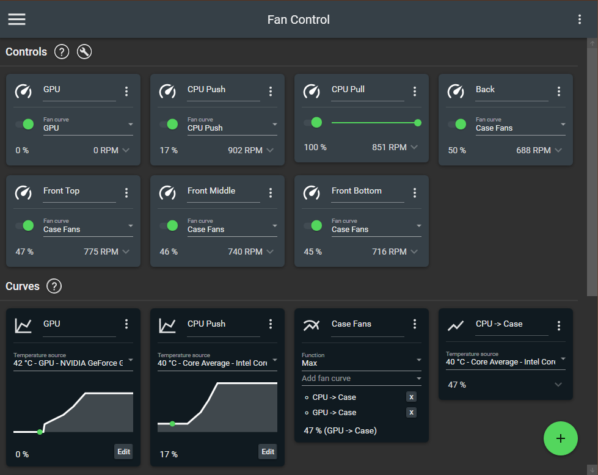
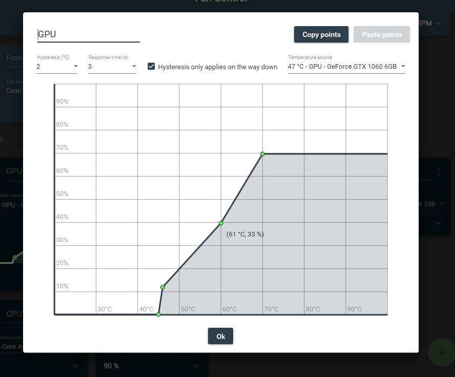

# Fan Control


<p align=center>
  <a href="https://www.getfancontrol.com">
    
  </a>
</p>


<p align=center>This is the release repository for <a href="https://getFanControl.com">Fan Control</a>, a focused and highly customizable fan controlling software for Windows.<br><i>Sources for this software are closed.</i></span>

<br>
<br>

[](/FanControl.zip?raw=true)
[](https://www.paypal.com/cgi-bin/webscr?cmd=_donations&business=N4JPSTUQHRJM8&currency_code=USD&source=url&item_name=Fan+Control)

## New

.NET 8 version now available. Had to update the Updater.exe to support the new version, might take some time for the usual Microsoft Defender false positive submission to go through.

## Installation

1. [Download the latest archive](/FanControl.zip?raw=true)
2. Extract to the desired installation folder
3. Start FanControl.exe
4. (Optional) -c or --config [json config file] command line arg 

### Install with [Scoop](https://scoop.sh/#/apps?s=2&d=1&o=true&p=1&q=fan+control)

```
scoop bucket add extras
scoop install fancontrol
```

# Documentation

https://getfancontrol.com/docs/

## Featured On
JayzTwoCents - Everyone NEEDS this FREE piece of software... You will thank me!

<a href="https://www.youtube.com/watch?v=uDPKVKBMQU8"></a>

## Main features

* Guided __setup__ process on first launch
* Save, edit and load multiple __profiles__
* Change the __theme__ and __color__ of the application.
* Multiple temperature __sources__ ( CPU, GPU, motherboard, hard drives... )
* Multiple fan curve __[functions](https://getfancontrol.com/docs)__, including a custom __[graph](#graph-fan-curve-editor)__
* __Mix__ fan curves or sensor togethers (max, min, average)
* Low resource usage
* Advanced tuning with steps, start %, stop %, response time and hysteresis



## Uninstall
Fan Control is a stand-alone app. You can leave the files there for use further down the line, or delete them.

Note: If you have Fan Control set to automatically start with Windows, either untick the checkbox in Fan Control, or manually delete the "Fan Control" task in Windows Task Scheduler.

## Plugins

 The plugin system let you inject any type of sensor into FanControl, see [Plugins wiki](https://github.com/Rem0o/FanControl.Releases/wiki/Plugins)

From the community (notify me if I'm missing some):
* https://github.com/fu-raz/FanControlThermaltake
* https://github.com/jmarucha/FanControl.Liquidctl
* https://github.com/Mourdraug/FanControl.AsusWMI to interface with ASUS motherboards through WMI methods
* https://github.com/medevil84/FanControl.AquacomputerDevices to interface with aquacomputer HighFlowNext, Quadro and Octo devices
* https://github.com/FoPzl/FanControl.AquacomputerQuadro to interface with aquacomputer Quadro 
* https://github.com/vision57/FanControl.GPU-Z
* https://github.com/EvanMulawski/FanControl.CorsairLink to interface with Corsair Commander controllers and Hydro liquid coolers
* https://github.com/EvanMulawski/FanControl.Razer to interface with Razer devices
* https://github.com/hgross/FanControl.HomeAssistant to interface with [HomeAssistant](https://github.com/home-assistant) connected temperature sensors (i.e. ambient temperatures via Philips Hue, HomeMatic, HomeKit or many other brands & protocols)
* https://github.com/brokenmass/Fancontrol.NzxtKraken to interface with NZXT Kraken AIO that are not yet supported by LibreHardwareMonitor for example `Kraken X2` and `Kraken X3 - new PID`. See [LHM PR](https://github.com/LibreHardwareMonitor/LibreHardwareMonitor/pull/1078)
* https://github.com/EightB1ts/FanControl.LianLi to interface with LianLi [L-Connect 3](https://lian-li.com/l-connect3/) fan controllers

From Rem0o
* (EXPERIMENTAL) https://github.com/Rem0o/FanControl.ADLX (AMD gpus)
* https://github.com/Rem0o/FanControl.HWInfo to import HWInfo sensor data
* https://github.com/Rem0o/FanControl.DellPlugin for dell laptops and some towers

## Issues and hardware compatibility

* I am not the main developer for the driver/backend portion of this software. Fan Control is basically a UI on top of existing hardware libraries. Any issue regarding hardware compatibility entirely depends on the following projects. If you can't contribute meaningfully with a branch/PR, don't pollute their issue page with "XXXXX doesn't work". The hardware is needed for testing. If a dev has interest in that project, is browsing it, has your specific hardware AND the knowledge to make it work, that dev won't be looking for your issue, he'll just raise a PR.
  * https://github.com/LibreHardwareMonitor/LibreHardwareMonitor
  * https://github.com/falahati/NvAPIWrapper
  
* Please only open issues on this repository for the software itself, UI, feature request and so on.
* If you do have a special hardware compatibility request and you can provide a __working__ sample of code that can be used in .NET, like with a [Plugin](https://github.com/Rem0o/FanControl.Releases/wiki/Plugins), then feel free to submit that.

## FAQ
* __Q__: What settings should I set in my BIOS to play along nicely with FanControl?
<br>__A__: You want to avoid any "smart" control from your BIOS. Setting a fixed default speed, like 50%, works great for most people. Also keep an eye if your BIOS has PWM or DC mode on. One could work better for you depending on your setup.
* __Q__: My Nvidia cards has X fans, but only two cards show up, why?
<br>__A__: Your card only has 2 channels, more than 1 fan are plugged to the same channel.
* __Q__: My new AMD card can't be controlled, why?
<br>__A__: Newer AMD cards are not supported. If you can provide a working sample of code that works with these newer cards, please share!
* __Q__: There is no control cards / control cards are missing / control cards are not changing my fan speeds, what's the issue?
<br>__A__: See __[ Issues and hardware compatibility](#issues-and-hardware-compatibility)__.
* __Q__: How does __[FAN CURVE TYPE]__ works and what does its parameters do?
<br>__A__: Click on its card's icon at the top left, a dialog will tell you.
* __Q__: Does it run on my OS?
<br>__A__: If your OS is Windows 10 __Or 11__, yes.

## Graph fan curve editor

* __(NEW)__ Change the temperature range for finer control over a small range
* Add, remove and drag points arround the graph
* Copy and paste points from a graph to another
* Fine-tune the response with the hysteresis and response time parameters



## Libraries used:
* https://github.com/LibreHardwareMonitor/LibreHardwareMonitor
* https://github.com/MaterialDesignInXAML/MaterialDesignInXamlToolkit
* https://github.com/falahati/NvAPIWrapper
