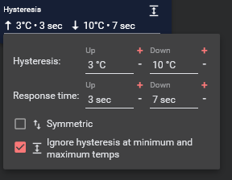
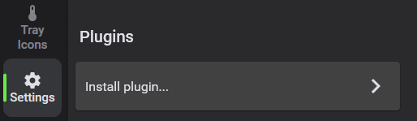

# Fan Control


<p align=center>
  <a href="https://www.getfancontrol.com">
    
  </a>
</p>


<p align=center>This is the release repository for <a href="https://getFanControl.com">Fan Control</a>, a focused and highly customizable fan controlling software for Windows.<br><i>Sources for this software are closed.</i></span>

<br>
<br>

[](/FanControl.zip?raw=true)
[](https://www.paypal.com/donate/?business=N4JPSTUQHRJM8&no_recurring=0&item_name=Fan%20Control%20software%20creator%20and%20maintainer.%20Donations%20allow%20me%20to%20continue%20working%20on%20this%20project%20while%20keeping%20it%20free%20to%20use.%20Thank%20you%20for%20contributing%21&currency_code=USD)

## Announcement

[V238](https://github.com/Rem0o/FanControl.Releases/releases/tag/V238) and above now ships with a [PawnIO](https://pawnio.eu/) build of [LHM](https://github.com/LibreHardwareMonitor/LibreHardwareMonitor). This will fix the anti-virus problems encountered with WinRing0, as it is no longer shipped with FanControl.  You may still use V237 or any version before if you want to keep the WinRing0 version.

There is a known issue where FACEIT will block the new driver. See this [issue](https://github.com/namazso/PawnIO.Setup/issues/1).

## WARNING ( V237 and below )

As of 09/04/2025, Winring0 (FanControl.sys) is flagged as [Trojan:Win32/Vigorf.A](https://github.com/Rem0o/FanControl.Releases/issues/3410#issuecomment-3254057373) by Windows Defender. This will cause sensors to not be detected.
You do not need to open an issue on the subject. Any new issues with this exact problem will be closed as duplicate.

If you experience this issue, you may:

* (Can't officialy recommend) whitelist/exclude the detection in Windows Security/Defender. Read the [official microsoft response/article](https://support.microsoft.com/en-us/windows/microsoft-defender-antivirus-alert-vulnerabledriver-winnt-winring0-eb057830-d77b-41a2-9a34-015a5d203c42) carefully. 
* With [V235 to V237](https://github.com/Rem0o/FanControl.Releases/releases), you can easily [use an alternative LHM branch](https://github.com/Rem0o/FanControl.Releases/issues/3410#issuecomment-3258597822) that doesn't use WinRing0. Consider this a Beta, as it hasn't been widely tested yet. It may not work, be unstable, not be reliable, you get the idea. 

To use the alternate branch (PawnIO, thanks to [@namazso](https://github.com/namazso)) :
1. Update to at least [__V235__](https://github.com/Rem0o/FanControl.Releases/releases), and close FanControl completely (EXIT).
2. (Optional but recommended) Backup your Configuration folder
3. Download the [net4.8](https://github.com/user-attachments/files/22304072/net472.zip) or [net8.0](https://github.com/user-attachments/files/22304071/net8.0.zip) version of LibreHardwareMonitorLib.dll depending on your existing installation
4. Install the [PawnIO driver](https://pawnio.eu/)
5. Place the LibreHardwareMonitorLib.dll inside your existing Plugins folder, or create a Plugins/ folder and place it in there
6. Launch FanControl
7. If successful, in the About tab, you should see (PawnIO) next to the LHM version.

## New
* New seperate "Up" and "Down" hysteresis for graph, linear and trigger fan curves

* The software is now open for translations. Contributions are welcomed here [FanControl.i18n](https://github.com/Rem0o/FanControl.i18n)
* AMD GPU support through [ADLXWrapper](https://github.com/Rem0o/ADLXWrapper).
* Fan calibration and RPM mode for fan curves. See [discussion](https://github.com/Rem0o/FanControl.Releases/discussions/2333).
* Installer now available in addition to the portable version of the application. Both .NET 4.8 and 8.0 versions of the application are available as such [here](https://github.com/Rem0o/FanControl.Releases/releases).

## Installation

1. [Download the latest archive](/FanControl.zip?raw=true) <i>or</i> [an installer from the release page](https://github.com/Rem0o/FanControl.Releases/releases). 
2. Extract to the desired installation folder <i>or</i> run the installer
3. Start FanControl.exe

### Install with [Scoop](https://scoop.sh/#/apps?s=2&d=1&o=true&p=1&q=fan+control)

```
scoop bucket add extras
scoop install fancontrol
```

### Install with [Winget](https://apps.microsoft.com/detail/9nblggh4nns1?rtc=1&hl=en-us&gl=US#activetab=pivot:overviewtab)

```
winget install Rem0o.FanControl
```

# Documentation

https://getfancontrol.com/docs/

## Featured On
JayzTwoCents - Everyone NEEDS this FREE piece of software... You will thank me!

<a href="https://www.youtube.com/watch?v=uDPKVKBMQU8"></a>

## Main features

* Guided __setup__ process on first launch
* Save, edit and load multiple __profiles__
* Change the __theme__ and __color__ of the application.
* Multiple temperature __sources__ ( CPU, GPU, motherboard, hard drives... )
* Multiple fan curve __[functions](https://getfancontrol.com/docs)__, including a custom __[graph](#graph-fan-curve-editor)__
* __Mix__ fan curves or sensor togethers (max, min, average)
* Low resource usage
* Advanced tuning with steps, start %, stop %, response time and hysteresis


## Uninstall

### Portable
You can leave the files there for use further down the line, or delete them.
Note: If you have Fan Control set to automatically start with Windows, either untick the checkbox in Fan Control, or manually delete the "Fan Control" task in Windows Task Scheduler.

### Installer
Uninstall like any other windows program through the programs list

## Plugins

 The plugin system let you inject any type of sensor into FanControl, see [Plugins wiki](https://github.com/Rem0o/FanControl.Releases/wiki/Plugins)



From the community (notify me if I'm missing some):
* https://github.com/AMoo-Miki/FanControlThermaltake updated fork of https://github.com/fu-raz/FanControlThermaltake
* https://github.com/jmarucha/FanControl.Liquidctl
* https://github.com/Mourdraug/FanControl.AsusWMI to interface with ASUS motherboards through WMI methods
* https://github.com/medevil84/FanControl.AquacomputerDevices to interface with aquacomputer HighFlowNext, Quadro and Octo devices
* https://github.com/FoPzl/FanControl.AquacomputerQuadro to interface with aquacomputer Quadro 
* https://github.com/vision57/FanControl.GPU-Z
* https://github.com/EvanMulawski/FanControl.CorsairLink to interface with Corsair Commander controllers and Hydro liquid coolers
* https://github.com/EvanMulawski/FanControl.Razer to interface with Razer devices
* https://github.com/hgross/FanControl.HomeAssistant to interface with [HomeAssistant](https://github.com/home-assistant) connected temperature sensors (i.e. ambient temperatures via Philips Hue, HomeMatic, HomeKit or many other brands & protocols)
* https://github.com/brokenmass/Fancontrol.NzxtKraken to interface with NZXT Kraken AIO that are not yet supported by LibreHardwareMonitor for example `Kraken X2` and `Kraken X3 - new PID`. See [LHM PR](https://github.com/LibreHardwareMonitor/LibreHardwareMonitor/pull/1078)
* https://github.com/EightB1ts/FanControl.LianLi to interface with LianLi [L-Connect 3](https://lian-li.com/l-connect3/) fan controllers
* https://github.com/TimSirmovics/FanControl.NvThermalSensors to get GPU Hot Spot and Memory Junction temperature for Nvidia GPUs
* https://github.com/SasaKaranovic/FanControl.OpenFan to interface with [OpenFAN](https://github.com/SasaKaranovic/OpenFanController) controller
* https://github.com/Brian-E-Taylor/FanControl.AIDA64 to get readings out of AIDA64
* https://github.com/Benson5650/FanControl.RazerCoolingPadPlugin to interface with Razer Laptop Cooling Pad.
* https://github.com/chenx-dust/FanControl.GPDPlugin to interface with GPD devices

From Rem0o
* https://github.com/Rem0o/FanControl.IntelCtlLibrary (Intel ARC gpus)
* https://github.com/Rem0o/FanControl.HWInfo to import HWInfo sensor data
* https://github.com/Rem0o/FanControl.DellPlugin for dell laptops and some towers

## Issues and hardware compatibility

* I am not the main developer for the driver/backend portion of this software. Fan Control is basically a UI on top of existing hardware libraries. Any issue regarding hardware compatibility entirely depends on the following projects. If you can't contribute meaningfully with a branch/PR, don't pollute their issue page with "XXXXX doesn't work". The hardware is needed for testing. If a dev has interest in that project, is browsing it, has your specific hardware AND the knowledge to make it work, that dev won't be looking for your issue, he'll just raise a PR.
  * https://github.com/LibreHardwareMonitor/LibreHardwareMonitor
  
* Please only open issues on this repository for the software itself, UI, feature request and so on. If it's a "make this work please" hardware support request, I will link this section of the README and close your issue.
* If you do have a special hardware compatibility request and you can provide a __working__ sample of code that can be used in .NET, like with a [Plugin](https://github.com/Rem0o/FanControl.Releases/wiki/Plugins), then feel free to submit that.

## FAQ
* __Q__: What settings should I set in my BIOS to play along nicely with FanControl?
<br>__A__: You want to avoid any "smart" control from your BIOS. Setting a fixed default speed, like 50%, works great for most people. Also keep an eye if your BIOS has PWM or DC mode on. One could work better for you depending on your setup.
* __Q__: My NVIDIA graphics card has 3 fans, but only 2 control cards show up in the UI, why?
<br>__A__: Your card only has 2 channels, multiple fans are plugged into the same channel.
* __Q__: My NVIDIA graphics card won't go below 30% and doesn't go to 0 RPM, why?
<br>__A__: [See here](https://github.com/Rem0o/FanControl.Releases/wiki/Nvidia-30%25-and-0-RPM)
* __Q__: There is no control cards / control cards are missing / control cards are not changing my fan speeds, what's the issue?
<br>__A__: See __[ Issues and hardware compatibility](#issues-and-hardware-compatibility)__.
* __Q__: How does __[FAN CURVE TYPE]__ works and what does its parameters do?
<br>__A__: Click on its card's icon at the top left, a dialog will tell you.
* __Q__: Does it run on my OS?
<br>__A__: If your OS is Windows 10 __Or 11__, yes.

## Libraries used:
* https://github.com/LibreHardwareMonitor/LibreHardwareMonitor (main sensor source)
* https://github.com/MaterialDesignInXAML/MaterialDesignInXamlToolkit (UI)
* https://github.com/falahati/NvAPIWrapper (Nvidia gpu fan control and sensor reading)
* https://github.com/Rem0o/ADLXWrapper (AMD gpu fan control and sensor reading)
* https://github.com/punker76/gong-wpf-dragdrop (various drag and drop actions)

## GitHub Sponsors 
The GitHub Sponsor button on this page is intended for the related open-source work surrounding FanControl. This includes contributions to the open-source libraries used, mainly [LHM](https://github.com/LibreHardwareMonitor/LibreHardwareMonitor), the plugin system and the various open-source plugins I contribute to, the AMD gpu driver support through [ADLXWrapper](https://github.com/Rem0o/ADLXWrapper), and more.  Your sponsorship helps me continue to contribute to the community, maintain existing projects, and develop new ones. It does not apply to the main program (FanControl) itself. Use the [Paypal](https://www.paypal.com/donate/?cmd=_donations&business=N4JPSTUQHRJM8&currency_code=USD&source=url&item_name=Fan+Control) donation button if your intent is to support the FanControl software itself. 
