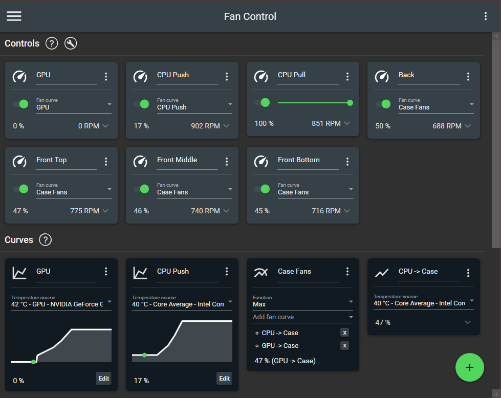
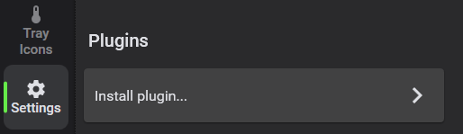

<h1 align="center">
  <a href="https://www.getfancontrol.com"></a><span>&nbsp;</span><span>Fan Control</span>
</h1>

<p align="center">A focused and highly customizable fan controlling software for Windows.<br><i>Sources for this software are closed.</i></p>

<p align="center">
  <a href="/FanControl.zip?raw=true"></a>
  <a href="https://www.paypal.com/donate/?business=N4JPSTUQHRJM8&no_recurring=0&item_name=Fan%20Control%20software%20creator%20and%20maintainer.%20Donations%20allow%20me%20to%20continue%20working%20on%20this%20project%20while%20keeping%20it%20free%20to%20use.%20Thank%20you%20for%20contributing%21&currency_code=USD"></a>
  <a href="https://buy.stripe.com/aFaeV75oSg0wcvhbKL0ZW00"></a>

</p>



---

## Featured On

**JayzTwoCents** — Everyone NEEDS this FREE piece of software... You will thank me!

<a href="https://www.youtube.com/watch?v=uDPKVKBMQU8">
  
</a>

## Table of Contents

- [Announcement](#announcement)
- [Main Features](#main-features)
- [Installation & Uninstall](#installation--uninstall)
- [Plugins](#plugins)
- [Issues & Hardware Compatibility](#issues-and-hardware-compatibility)
- [FAQ](#faq)
- [Libraries Used](#libraries-used)
- [GitHub Sponsors](#github-sponsors)

## Announcement

- FanControl, its installer and the updater now have a signed executable, which should help with AVs false flagging.
- [V238](https://github.com/Rem0o/FanControl.Releases/releases/tag/V238) and above now ships with a [PawnIO](https://pawnio.eu/) build of [LHM](https://github.com/LibreHardwareMonitor/LibreHardwareMonitor). This fixes the anti-virus problems encountered with WinRing0, as it is no longer shipped with FanControl. Note that as of 09/04/2025, WinRing0 (FanControl.sys) used in V237 and below is flagged as [Trojan:Win32/Vigorf.A](https://github.com/Rem0o/FanControl.Releases/issues/3410#issuecomment-3254057373) by Windows Defender, causing sensors to not be detected — updating to V238 or later is the recommended fix.
- The FaceIT issue was fixed with the [2.1.0 PawnIO version](https://github.com/namazso/PawnIO.Setup/releases/tag/2.1.0).

## Main Features

- Guided **setup** process on first launch
- Save, edit and load multiple **profiles**
- Change the **theme** and **color** of the application
- Multiple temperature **sources** (CPU, GPU, motherboard, hard drives...)
- Multiple fan curve **[functions](https://getfancontrol.com/docs)**, including a custom **[graph](#graph-fan-curve-editor)**
- **Mix** fan curves or sensors together (max, min, average)
- Low resource usage
- Advanced tuning with steps, start %, stop %, response time and hysteresis

Full documentation is available at **[getfancontrol.com/docs](https://getfancontrol.com/docs/)**.

## Installation & Uninstall

### Install

1. [Download the latest archive](/FanControl.zip?raw=true) *or* [an installer from the release page](https://github.com/Rem0o/FanControl.Releases/releases).
2. Extract to the desired installation folder *or* run the installer.
3. Start `FanControl.exe`.

<details>
<summary>Other install methods (Scoop / Winget)</summary>

**[Scoop](https://scoop.sh/#/apps?s=2&d=1&o=true&p=1&q=fan+control)**
```
scoop bucket add extras
scoop install fancontrol
```

**[Winget](https://apps.microsoft.com/detail/9nblggh4nns1?rtc=1&hl=en-us&gl=US#activetab=pivot:overviewtab)**
```
winget install Rem0o.FanControl
```

</details>

### Uninstall

**Portable** — You can leave the files there for future use, or delete them.

> **Note:** If you have Fan Control set to automatically start with Windows, either untick the checkbox in Fan Control, or manually delete the "Fan Control" task in Windows Task Scheduler.

**Installer** — Uninstall like any other Windows program through the Programs list.

## Plugins

The plugin system lets you inject any type of sensor into FanControl. See the [Plugins wiki](https://github.com/Rem0o/FanControl.Releases/wiki/Plugins) for details.



### From Rem0o

| Plugin | Description |
|--------|-------------|
| [FanControl.IntelCtlLibrary](https://github.com/Rem0o/FanControl.IntelCtlLibrary) | Intel ARC GPU support |
| [FanControl.HWInfo](https://github.com/Rem0o/FanControl.HWInfo) | Import HWInfo sensor data |
| [FanControl.DellPlugin](https://github.com/Rem0o/FanControl.DellPlugin) | Dell laptops and some towers |

### From the Community

> *Notify me if I'm missing some.*

| Plugin | Description |
|--------|-------------|
| [FanControl.Thermaltake](https://github.com/AMoo-Miki/FanControlThermaltake) | Thermaltake devices (updated fork of [fu-raz/FanControlThermaltake](https://github.com/fu-raz/FanControlThermaltake)) |
| [FanControl.LiquidCtl](https://github.com/antoine-bouteiller/FanControl.LiquidCtl) | AIO devices via [liquidctl](https://github.com/liquidctl/liquidctl); updated fork with multi-fan controller support |
| [FanControl.AsusWMI](https://github.com/Mourdraug/FanControl.AsusWMI) | ASUS motherboards via WMI |
| [FanControl.AquacomputerDevices](https://github.com/medevil84/FanControl.AquacomputerDevices) | Aquacomputer HighFlowNext, Quadro and Octo |
| [FanControl.AquacomputerQuadro](https://github.com/FoPzl/FanControl.AquacomputerQuadro) | Aquacomputer Quadro |
| [FanControl.GPU-Z](https://github.com/vision57/FanControl.GPU-Z) | GPU-Z sensor data |
| [FanControl.CorsairLink](https://github.com/EvanMulawski/FanControl.CorsairLink) | Corsair Commander controllers and Hydro liquid coolers |
| [FanControl.Razer](https://github.com/EvanMulawski/FanControl.Razer) | Razer devices |
| [FanControl.HomeAssistant](https://github.com/hgross/FanControl.HomeAssistant) | [HomeAssistant](https://github.com/home-assistant) temperature sensors (Philips Hue, HomeMatic, HomeKit, etc.) |
| [FanControl.NzxtKraken](https://github.com/brokenmass/Fancontrol.NzxtKraken) | NZXT Kraken AIOs not yet in LHM (e.g. Kraken X2, X3 new PID) |
| [FanControl.LianLi](https://github.com/EightB1ts/FanControl.LianLi) | LianLi [L-Connect 3](https://lian-li.com/l-connect3/) fan controllers |
| [FanControl.NvThermalSensors](https://github.com/TimSirmovics/FanControl.NvThermalSensors) | Nvidia GPU Hot Spot and Memory Junction temperatures |
| [FanControl.OpenFan](https://github.com/SasaKaranovic/FanControl.OpenFan) | [OpenFAN](https://github.com/SasaKaranovic/OpenFanController) controller |
| [FanControl.AIDA64](https://github.com/Brian-E-Taylor/FanControl.AIDA64) | AIDA64 sensor readings |
| [FanControl.RazerCoolingPadPlugin](https://github.com/Benson5650/FanControl.RazerCoolingPadPlugin) | Razer Laptop Cooling Pad |
| [FanControl.GPDPlugin](https://github.com/chenx-dust/FanControl.GPDPlugin) | GPD devices |
| [FanControl.LenovoPlugin](https://github.com/jiarandiana0307/FanControl.LenovoPlugin) | Lenovo laptops with `Lenovo ACPI-Compliant Virtual Power Controller` |

## Issues and Hardware Compatibility

Fan Control is primarily a UI layer on top of existing hardware libraries. Any hardware compatibility issue is largely dependent on the upstream project:

- **[LibreHardwareMonitor](https://github.com/LibreHardwareMonitor/LibreHardwareMonitor)** — the main sensor/driver backend

Please **only open issues on this repository** for the software itself: UI bugs, feature requests, etc. Hardware support requests will be closed with a link to this section.

If you have a hardware compatibility request and can provide a **working** code sample usable in .NET (e.g. via a [Plugin](https://github.com/Rem0o/FanControl.Releases/wiki/Plugins)), feel free to submit that.

## FAQ

**Q: What BIOS settings work best with FanControl?**
> Avoid any "smart" fan control from your BIOS. Setting a fixed default speed (e.g. 50%) works great for most people. Also check whether your BIOS uses PWM or DC mode — one may work better depending on your setup.

**Q: My NVIDIA GPU has 3 fans but only 2 control cards show up. Why?**
> Your card only has 2 channels; multiple fans are wired to the same channel.

**Q: My NVIDIA GPU won't go below 30% and doesn't reach 0 RPM. Why?**
> [See this wiki page](https://github.com/Rem0o/FanControl.Releases/wiki/Nvidia-30%25-and-0-RPM).

**Q: There are no control cards, or control cards aren't changing fan speeds. What's the issue?**
> See [Issues & Hardware Compatibility](#issues-and-hardware-compatibility).

**Q: How does [FAN CURVE TYPE] work and what do its parameters do?**
> Click the card's icon at the top left — a dialog will explain it.

**Q: What OS does it run on?**
> Windows 10 and Windows 11.

## Libraries Used

| Library | Purpose |
|---------|---------|
| [LibreHardwareMonitor](https://github.com/LibreHardwareMonitor/LibreHardwareMonitor) | Main sensor source |
| [MaterialDesignInXamlToolkit](https://github.com/MaterialDesignInXAML/MaterialDesignInXamlToolkit) | UI framework |
| [NvAPIWrapper](https://github.com/falahati/NvAPIWrapper) | Nvidia GPU fan control and sensor reading |
| [ADLXWrapper](https://github.com/Rem0o/ADLXWrapper) | AMD GPU fan control and sensor reading |
| [gong-wpf-dragdrop](https://github.com/punker76/gong-wpf-dragdrop) | Drag and drop interactions |

## GitHub Sponsors

The GitHub Sponsor button on this page is intended for the **open-source work surrounding FanControl**. This includes contributions to [LibreHardwareMonitor](https://github.com/LibreHardwareMonitor/LibreHardwareMonitor), the plugin system and open-source plugins, and AMD GPU driver support via [ADLXWrapper](https://github.com/Rem0o/ADLXWrapper).

Your sponsorship helps maintain existing projects and develop new ones. It does **not** apply to the main FanControl program itself — use the [PayPal](https://www.paypal.com/donate/?cmd=_donations&business=N4JPSTUQHRJM8&currency_code=USD&source=url&item_name=Fan+Control) button if your intent is to support FanControl directly.
